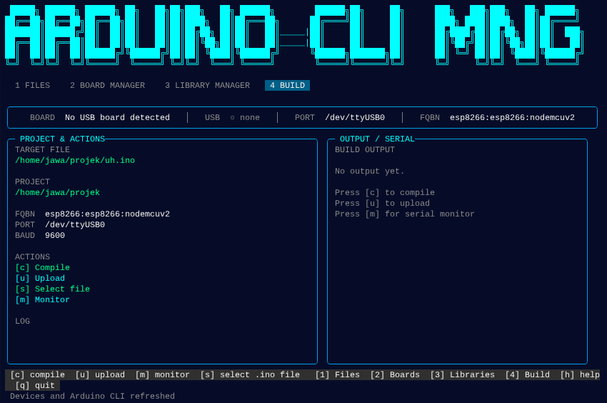

<p align="center">
  
</p>

<h1 align="center">🖥️ Arduino CLI Manager</h1>

<p align="center">
  <b>Terminal-based Arduino CLI dashboard — lightweight, built for low-spec machines.</b>
</p>

<p align="center">
  
  
</p>

> 💻 **Too slow for Arduino IDE?** The official IDE is heavy and laggy on old hardware. This tool gives you the full Arduino workflow — file management, board/library management, compile, upload, and serial monitor — directly from your terminal. No GUI overhead, no lag.

---

## 📋 Table of Contents

- [Features](#-features)
- [Prerequisites](#-prerequisites)
- [Installation](#-installation)
- [Usage](#-usage)
- [Key Bindings](#-key-bindings)
- [Feature Details](#-feature-details)
- [Configuration](#-configuration)
- [Project Structure](#-project-structure)
- [How It Works](#-how-it-works)
- [Troubleshooting](#-troubleshooting)

---

## ✨ Features

| Feature | Description |
|---------|-------------|
| **File Explorer** | Browse, preview & edit workspace files (`.ino`, `.cpp`, `.h`, etc.) |
| **Board Manager** | Search, install & update Arduino board cores via `arduino-cli` |
| **Library Manager** | Search, install & update libraries via `arduino-cli` |
| **Build Workflow** | Compile + upload to board directly from terminal |
| **Serial Monitor** | Real-time USB serial output with configurable baud rate |
| **Smart Parsing** | Handles both JSON and plain text output from `arduino-cli` |
| **Per-Project Config** | FQBN, port, and baud rate per-project via `.arduino-env` file |
| **NVM Support** | Auto-detects NVM-managed Node.js installations |

---

## 🔧 Prerequisites

> ⚠️ **Important:** This tool is a **dashboard / frontend** for `arduino-cli`. You must have `arduino-cli` installed first.

### 1. Arduino CLI

Download and install `arduino-cli`:

👉 **[https://arduino.github.io/arduino-cli/installation/](https://arduino.github.io/arduino-cli/installation/)**

```bash
# Linux / macOS (quick install)
curl -fsSL https://raw.githubusercontent.com/arduino/arduino-cli/master/install.sh | sh
```

Make sure it's available in your `$PATH`:

```bash
arduino-cli version
```

Then initialize and install your board platforms:

```bash
arduino-cli core update-index
arduino-cli core install esp8266:esp8266    # example: ESP8266
arduino-cli core install arduino:avr         # example: Arduino Uno
```

### 2. Node.js

| Software | Version | Notes |
|----------|---------|-------|
| **Node.js** | v18+ | ES Modules (`import`) |
| **OS** | Linux / macOS / Windows | |

> On Windows, run `node src/index.mjs` directly instead of the `arduino-tui` shell script (use Git Bash / WSL for the shell launcher).

### 3. Optional

| Tool | Used for |
|------|----------|
| `$EDITOR` / `nano` | Editing files from the File Explorer panel |

---

## 📦 Installation

### 1. Clone

```bash
git clone https://github.com/IKInecro/Arduino-cli-manager.git
cd Arduino-cli-manager
```

### 2. Make executable

```bash
chmod +x arduino-tui
```

No `npm install` needed — zero Node.js dependencies.

### 3. Call from anywhere (optional)

```bash
ln -s $(pwd)/arduino-tui ~/.local/bin/arduinotui
```

Then just type `arduinotui` in your terminal.

---

## 🚀 Usage

```bash
./arduino-tui
```

Or if symlinked:

```bash
arduinotui
```

### Quick Start

1. Run `arduinotui` — the dashboard loads your workspace file tree
2. Press `[2]` to manage board cores, `[3]` for libraries
3. Press `[4]` → `[s]` to select a `.ino` file → `[c]` to compile
4. Connect your board, press `[u]` to compile + upload

---

## ⌨️ Key Bindings

### Navigation

| Key | Panel |
|-----|-------|
| `1` | **Files** — workspace file tree |
| `2` | **Boards** — search/install board cores |
| `3` | **Libraries** — search/install libraries |
| `4` | **Build** — compile, upload, serial monitor |
| `h` | **Help** — show keyboard guide |
| `q` | **Quit** — exit application |

### Panel 1 — Files

| Key | Action |
|-----|--------|
| `↑` / `↓` | Navigate file tree |
| `→` | Expand folder |
| `←` | Collapse folder |
| `Enter` / `e` | Open file in `$EDITOR` (default: nano) |
| `r` | Refresh USB device list |

Right panel shows a file preview (first 12 lines) or item count for folders.

### Panel 2 & 3 — Boards & Libraries

| Key | Action |
|-----|--------|
| `↑` / `↓` | Select item in list |
| `Enter` | Install package (editable name prompt) |
| `s` | Search packages |
| `u` | Update package index |
| `r` | Reload installed list |

Output from `arduino-cli` is parsed automatically — supports both JSON and plain text.

### Panel 4 — Build

| Key | Action |
|-----|--------|
| `s` | Scan & select `.ino` file (file picker) |
| `c` | Compile (`arduino-cli compile --fqbn ...`) |
| `u` | Compile + upload to board |
| `m` | Toggle serial monitor |

When serial monitor is active, USB output streams to the right panel in real time.

---

## 🧩 Feature Details

### 📁 File Explorer
Browse your entire workspace from the terminal. System folders (`node_modules`, `.git`, `.cache`, etc.) are hidden. Expand/collapse folders, preview file contents, and edit directly in `nano` or your preferred `$EDITOR`.

### 🧩 Board Manager
Search Arduino board platforms, view installed versions, check for updates, and install new ones — all from one panel. Supports all platforms available via `arduino-cli core` commands.

### 📚 Library Manager
Same interface as boards but for libraries. Search by name, view author/version/license/summary, install with one key press.

### ⚙️ Build Workflow
Select a `.ino` file, set your FQBN and port (per-project via `.arduino-env`), then compile or compile+upload with a single key. Build output is captured and displayed in the right panel.

### 🔌 Serial Monitor
Start/stop the serial monitor with `[m]`. Supports configurable baud rate. USB output streams live to the right panel — no need for the Arduino IDE's Serial Monitor.

---

## ⚙️ Configuration

### Global config: `.arduino-tui.json`

Located in the project root:

```json
{
  "projectRoot": "/home/user/arduino-projects/my-sketch",
  "fqbn": "esp8266:esp8266:nodemcuv2",
  "port": "/dev/ttyUSB0",
  "baud": "115200",
  "targetFile": "/home/user/arduino-projects/my-sketch/sketch.ino"
}
```

### Per-project config: `.arduino-env`

Create this file inside your project directory:

```
fqbn=esp8266:esp8266:nodemcuv2
port=/dev/ttyUSB0
baud=115200
```

These settings are read automatically when the **Build** panel is active or when refreshing (`r`). FQBN, PORT, and BAUD can be set per-project without affecting other projects.

---

## 📁 Project Structure

```
arduino-cli-mng/
├── arduino-tui              # Shell entry point (finds Node.js, execs into app)
├── src/
│   └── index.mjs            # Main application (~564 lines)
├── asset/
│   └── imange.png           # Screenshot for README
├── package.json             # Metadata
├── .arduino-tui.json        # User configuration (gitignored)
├── .arduino-tui.json.example # Example config
├── .gitignore
└── README.md                # This documentation
```

### Main File: `src/index.mjs`

Single-file TUI application (~564 lines) with this structure:

```
📄 index.mjs
├── Config & State
├── Utilities (ANSI, helpers, logging)
├── File System (file tree walker)
├── TUI Panels (render functions for all 4 views)
├── Manager (board/library search/install)
├── Build System (compile, upload, serial monitor)
├── Key Bindings (onKey handler)
├── Lifecycle (init, cleanup)
└── Main Entry
```

---

## 🔍 How It Works

1. **`arduino-tui`** (shell script) locates Node.js — including NVM-managed installations — then `exec`s into `src/index.mjs`.
2. **`src/index.mjs`** enables raw mode on stdin, captures keyboard input, and renders the TUI via ANSI escape codes.
3. All Arduino operations (compile, upload, board/library list, serial monitor) are executed via `child_process` to the `arduino-cli` binary.
4. The serial monitor runs as a long-lived subprocess — its stdout is streamed and displayed in real time on the **Build** panel.

---

## 🔍 Troubleshooting

### "Node.js not found"
- Install Node.js v18+ or activate an NVM-managed Node installation
- The launcher script checks NVM_DIR automatically

### "arduino-cli not found"
- Make sure `arduino-cli` is installed and in your `$PATH`
- Run `arduino-cli version` to verify

### No USB board detected
- Connect your board via USB
- Press `[r]` (refresh) in the **Files** panel
- Check the status bar — it shows connected USB devices

### Compile/upload fails
- Make sure the correct board platform is installed (`arduino-cli core install ...`)
- Verify your FQBN is correct (check `.arduino-env` or `.arduino-tui.json`)
- Check the port setting (e.g., `/dev/ttyUSB0` or `COM3`)

### Serial monitor shows garbage
- Make sure the baud rate matches your board's configuration
- Common baud rates: `9600`, `115200`, `57600`

### Terminal display broken
- Press `q` to quit normally (auto-cleanup)
- If force-closed, run `reset` in your terminal

---

<p align="center">
  Made with ❤️ by <a href="https://github.com/IKInecro">IKInecro</a>
</p>
